# GDD Organizer - System Architecture Diagram

A visual overview of how the **Game Design Document (GDD) Organizer** project works.

---

## 🏗️ High-Level Architecture

```mermaid
flowchart TB
    subgraph Frontend["🌐 Frontend (Browser)"]
        direction TB
        HTML["HTML Pages"]
        CSS["CSS Styling"]
        JS["JavaScript"]
    end
    
    subgraph Backend["⚙️ Backend (PHP)"]
        direction TB
        AUTH["auth.php"]
        PROJ["projects.php"]
        DB_CONN["database.php"]
        OAUTH["oauth_callback.php"]
    end
    
    subgraph Database["🗄️ MySQL Database"]
        direction TB
        USERS["users"]
        PROJECTS["projects"]
        ASSETS["assets"]
        CHARS["characters"]
        STORY["story_nodes"]
    end
    
    subgraph External["☁️ External Services"]
        GOOGLE["Google OAuth"]
    end
    
    Frontend <-->|"AJAX/Fetch API"| Backend
    Backend <-->|"PDO Connection"| Database
    AUTH <-->|"OAuth 2.0"| GOOGLE
```

---

## 📁 File Structure Overview

```mermaid
flowchart LR
    subgraph Root["📂 FP-PWEB/"]
        direction TB
        INDEX["index.html<br/>Landing & Dashboard"]
        NAV["nav.html<br/>Navigation Component"]
        ADMIN["admin.html<br/>Admin Panel"]
    end
    
    subgraph Pages["📂 pages/"]
        direction TB
        LOGIN["login.html"]
        SIGNUP["signup.html"]
        EDIT["edit-project.html<br/>Main Editor"]
        PROFILE["profile.html"]
    end
    
    subgraph PHP["📂 php/"]
        direction TB
        P_AUTH["auth.php"]
        P_PROJ["projects.php"]
        P_DB["database.php"]
        P_OAUTH["oauth_callback.php"]
        P_UPLOAD["upload.php"]
    end
    
    subgraph Assets["📂 assets/"]
        direction TB
        UPLOADS["uploads/"]
        IMAGES["images/"]
    end
    
    Root --> Pages
    Root --> PHP
    Root --> Assets
```

---

## 🔐 Authentication Flow

```mermaid
sequenceDiagram
    participant U as 👤 User
    participant F as 🌐 Frontend
    participant A as ⚙️ auth.php
    participant O as ☁️ Google OAuth
    participant D as 🗄️ Database
    
    Note over U,D: Standard Login Flow
    U->>F: Enter credentials
    F->>A: POST /auth.php<br/>action=login
    A->>D: Validate user
    D-->>A: User data
    A-->>F: Session created
    F-->>U: Redirect to Dashboard
    
    Note over U,D: Google OAuth Flow
    U->>F: Click "Sign in with Google"
    F->>A: POST action=google_login
    A->>O: Redirect to Google
    O-->>U: Google consent screen
    U->>O: Approve access
    O->>A: Authorization code
    A->>O: Exchange for tokens
    O-->>A: User info
    A->>D: Create/find user
    A-->>F: oauth_success.html
    F-->>U: Redirect to Dashboard
```

---

## 📊 Database Schema

---

## 🎮 Core Feature Workflows

```mermaid
flowchart TB
    subgraph Dashboard["📋 Dashboard (index.html)"]
        D1["View Projects"]
        D2["Create New Project"]
        D3["Delete Project"]
    end
    
    subgraph Editor["✏️ Project Editor (edit-project.html)"]
        direction TB
        E1["🖼️ Asset Gallery"]
        E2["🧙 Character Builder"]
        E3["📖 Storyline Editor"]
    end
    
    subgraph API["⚙️ projects.php Actions"]
        A1["getProjects"]
        A2["createProject"]
        A3["updateProject"]
        A4["uploadAsset"]
        A5["saveCharacter"]
        A6["saveStory"]
    end
    
    D1 --> A1
    D2 --> A2
    
    E1 -->|"Upload files"| A4
    E2 -->|"Save stats"| A5
    E3 -->|"Save nodes"| A6
```

---

## 🌊 Data Flow: Create & Edit Project

---

## 🧩 Interactive Storyline System

```mermaid
flowchart TD
    subgraph Canvas["📝 Storyline Canvas"]
        START["🟢 Start Node"]
        N1["📄 Node 1"]
        N2["📄 Node 2"]
        N3["📄 Node 3"]
        N4["📄 Node 4"]
        
        START -->|"Choice A"| N1
        START -->|"Choice B"| N2
        N1 -->|"Continue"| N3
        N2 -->|"Continue"| N3
        N3 -->|"Ending"| N4
    end
    
    subgraph Actions["🎛️ Toolbar Actions"]
        ADD["➕ Add Node"]
        LINK["🔗 Connect Nodes"]
        EDIT["✏️ Edit Text"]
        ZOOM["🔍 Zoom In/Out"]
        SAVE["💾 Save Story"]
    end
    
    subgraph Storage["💽 Data Storage"]
        JSON["JSON: nodes + connections"]
        DB["story_nodes table"]
    end
    
    Actions --> Canvas
    SAVE --> JSON
    JSON -->|"saveStory action"| DB
```

---

## 🔄 Request/Response Cycle

---

## 🎯 Summary

| Layer | Technology | Purpose |
|-------|------------|---------|
| **Frontend** | HTML5, CSS3, JS (ES6+) | User interface & interactions |
| **Backend** | PHP 8+ with PDO | API endpoints & business logic |
| **Database** | MySQL | Persistent data storage |
| **Auth** | Session + Google OAuth | User authentication |
| **Styling** | Bootstrap 5 + Custom CSS | Dark theme UI |

---

> **Note**: This is a classic **3-tier architecture** with a PHP REST-like API serving a vanilla JavaScript frontend, connected to a MySQL database.
